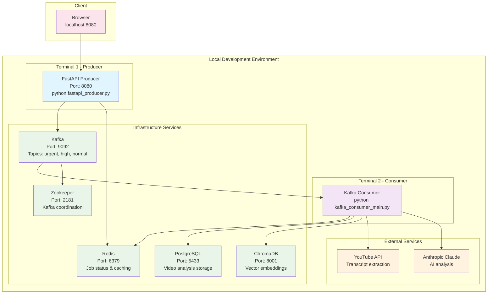
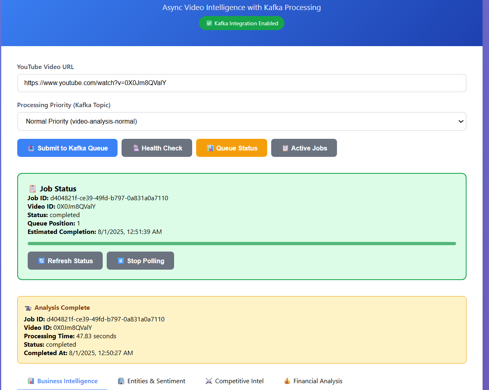
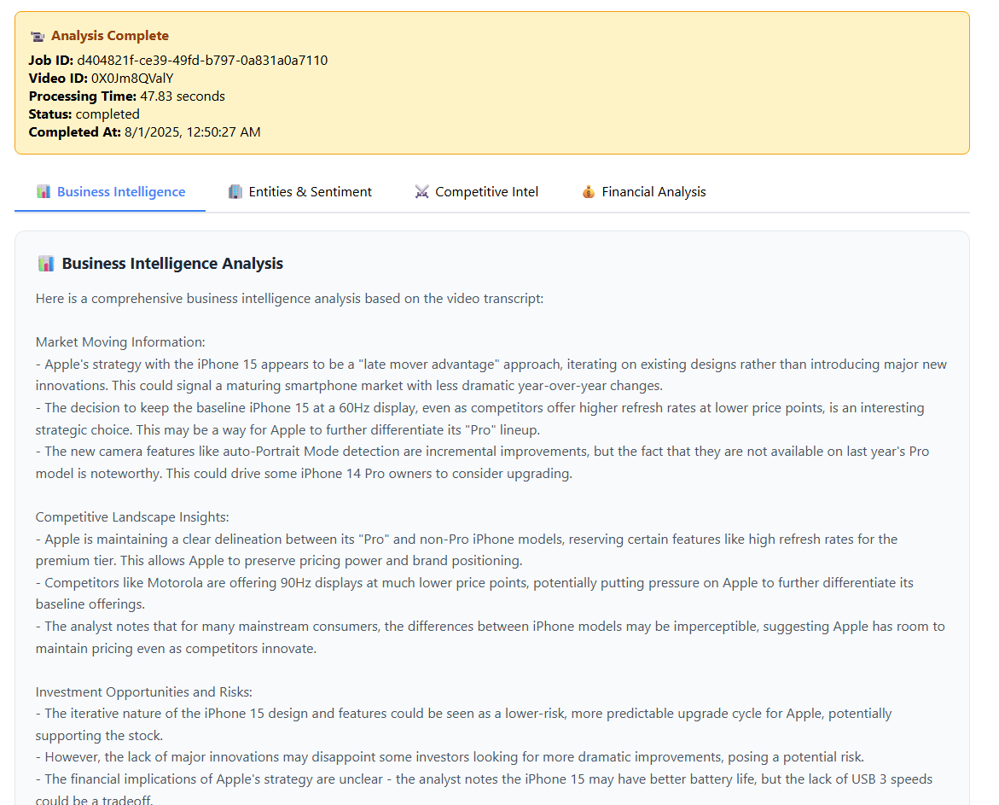

# 🎬 Video Intelligence - Development Setup

## Architecture Overview

Video Intelligence uses a microservices architecture with Kafka message queues for asynchronous video processing:

- **FastAPI Producer**: Handles web requests and job submission  
- **Kafka Consumer**: Processes videos independently  
- **Kafka**: Message queue for job distribution  
- **Redis**: Job status tracking and caching  
- **PostgreSQL**: Persistent video analysis storage  
- **ChromaDB**: Vector embeddings for semantic search  


---




## 📋 Prerequisites

- Python 3.11+  
- Docker & Docker Compose  
- Anthropic API Key  

---

## Project Structure

```
babbl-data-engineering/
├── fastapi_producer.py           # Web API & job submission
├── kafka_consumer_main.py        # Consumer entry point
├── services/
│   ├── kafka_consumer_service.py # Core processing logic
│   ├── transcript_extractor.py   # YouTube transcript extraction
│   ├── langchain_analyzer.py     # AI analysis with Claude
│   └── chromadb_integration.py   # Vector storage
├── index.html                    # Frontend interface
├── docker-compose.yml            # Infrastructure services
└── requirements.txt              # Python dependencies
```

## 🚀 Quick Start for Local Development

### 1. Clone Repository

```bash
git clone https://github.com/theyaneshj17/video-intelligence-aws.git

```


### 2. Environment Setup

```bash
# Create virtual environment
python -m venv venv
source venv/bin/activate  # Linux/Mac
# or
venv\Scripts\activate     # Windows

# Install dependencies
pip install -r requirements.txt

# Set environment variables
export ANTHROPIC_API_KEY="your-anthropic-api-key-here"
```

### 3. Start Infrastructure Services

```bash
# Start Kafka, Redis, PostgreSQL, ChromaDB
docker-compose up -d

# Wait for services to be ready
sleep 30
```

### 4. Start Application Services

#### Terminal 1 - FastAPI Producer:

```bash
python fastapi_producer.py
```

#### Terminal 2 - FastAPI Producer:

```bash
python kafka_consumer_main.py
```

### 5. Access Application

-- Web Interface: http://localhost:8080
-- API Documentation: http://localhost:8080/docs
-- Health Check: http://localhost:8080/health


### 6. Testing

Submit a Video Job

```bash
curl -X POST http://localhost:8080/analyze \
  -H "Content-Type: application/json" \
  -d '{
    "youtube_url": "https://www.youtube.com/watch?v=0X0Jm8QValY",
    "priority": "high"
  }'
```


## Outputs




